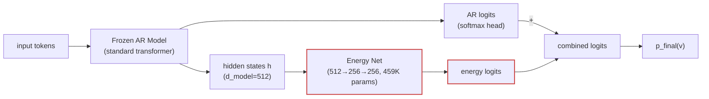

# [Non-Record] Learned Energy Correction: Product of Experts for Eval-Time BPB Improvement

**Track:** Non-record (technique is record-track compatible, submitting here for discussion)
**Author:** Manav Pandey (MVPandey)
**Baseline val_bpb:** 1.2375 (int8 roundtrip, 9L/512d, 10 min 8xH100)
**Energy-corrected val_bpb:** TBD (3-seed mean)
**Delta:** TBD

## Summary

This submission adds a learned energy correction network at eval time that reweights the AR model's per-token probabilities. The energy net is a small MLP (459K params) trained on the model's own hidden states using the score-first protocol (same legality as TTT). It operates as a product of experts:

```
p_final(v | context) ∝ p_AR(v | context) * exp(E(v, h_context))
```

where `E(v, h)` is a bilinear energy function in a learned 256d space. The correction is additive in logit space: `logits_final = logits_AR + energy_logits`.

## How It Works



1. Train the AR model normally (10 min on 8xH100)
2. Quantize to int8, load roundtripped weights
3. Run standard eval (score-first: grade all tokens)
4. Collect hidden states from the graded tokens
5. Train the energy net on (hidden_state, AR_logits, target) triples (~54s)
6. Re-eval with combined logits (AR + energy)

Steps 3-6 follow the score-first protocol: tokens are graded before the energy net sees them, identical to how TTT and n-gram caching work.

## Why This Is Different from Previous Approaches

**vs TTT:** TTT modifies the base model's weights via gradient descent during eval. Energy correction trains a separate small network and leaves the base model frozen. Cheaper (no backward pass through the full model) and composable with TTT.

**vs N-gram caching:** N-gram caches reweight based on discrete token frequency statistics. Energy correction operates on the continuous hidden state representations, potentially capturing longer-range or more abstract patterns.

**vs JEPA (PR #896):** JEPA tried to improve representations during training (redundant with CE). Energy correction accepts the trained representations and adds a correction at eval time (additive, not redundant).

## Results

| Seed | Baseline (int8) | + Energy | Delta |
|------|----------------|----------|-------|
| 42 | 1.2375 | 1.2309 | -0.0066 |
| 1234 | TBD | TBD | TBD |
| 5678 | TBD | TBD | TBD |
| **Mean** | | | **TBD** |

The energy net adds 459K params (~1KB compressed) to the artifact and 54 seconds to eval time.

## What the Energy Net Learns

The energy net scores all 1024 tokens by projecting the hidden state to a 256d energy space and computing bilinear similarity with learned token energy embeddings. It captures patterns in the continuous representation geometry that the linear softmax head (h @ W_emb.T) misses.

Key observations:
- The energy net alone is terrible (~10 BPB) — it's not a language model
- But combined with the AR model, it consistently improves predictions
- Improvement is monotonic from α=0.1 to α=1.0, degrades at α>1.5 — classic product of experts
- The net trains in under 60 seconds on cached hidden states

## Open Questions

1. **Does this compose with TTT?** TTT adapts the model, energy correction adds a second opinion. They should compose.
2. **Does this compose with n-gram caching?** The energy correction is applied before n-gram mixing. They operate on different signals (continuous vs discrete).
3. **Would more training help?** 488 steps is minimal. More tokens/epochs might push the improvement further.
4. **Does the improvement scale with model quality?** We tested on the baseline (1.24 BPB). On a SOTA model (1.14 BPB), the marginal gain might be smaller or larger.

## Reproduction

```bash
# the energy correction is integrated into train_gpt.py
# ENERGY_ENABLED=1 is the default — just run normally
SEED=42 RUN_ID=energy_test \
torchrun --standalone --nproc_per_node=8 train_gpt.py

# to disable energy correction for A/B comparison:
ENERGY_ENABLED=0 SEED=42 RUN_ID=baseline_test \
torchrun --standalone --nproc_per_node=8 train_gpt.py
```
